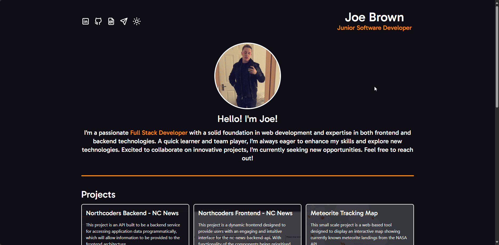

# Portfolio Website

 

</a>
 

## Hosted Version

[Deployed Version (Click Me)](https://joedev.co.uk/)

## Project Summary

This project is a personal portfolio website designed to showcase my skills, experience, and projects in a clean and engaging way.

### What went well:

- The website effectively showcases my skills and projects in a structured and visually appealing manner.

- Smooth navigation and responsive design ensure a user-friendly experience across devices.

### Challenges faced:

- Framer Motion animations, while functional, didn’t meet my initial expectations in terms of visual impact. Fine-tuning the animations for better consistency and fluidity proved challenging.

- Deploying the website introduced some hurdles, particularly due to import errors due to assets in /src that were not built with the production build that required debugging. Imports were changed and now follow Vite / React best practices.

### Summary

This project not only strengthened my technical skills in web development and deployment but also taught me valuable lessons in troubleshooting and refining design elements to meet user expectations.

## Tech Stack

- React
- TypeScript
- TailwindCSS
- Vite
- React Hot Toast

## Planned Features

- Framer Motion Implementation
